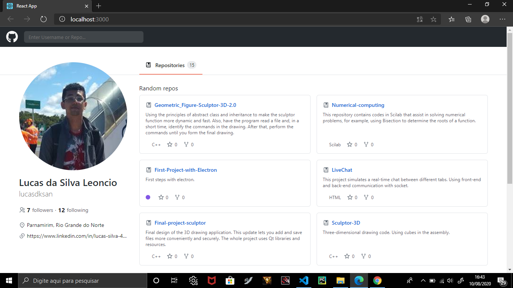
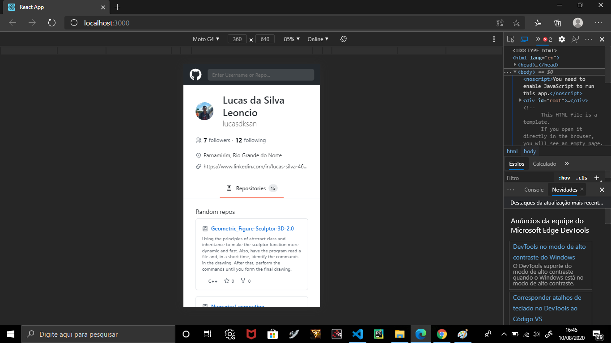
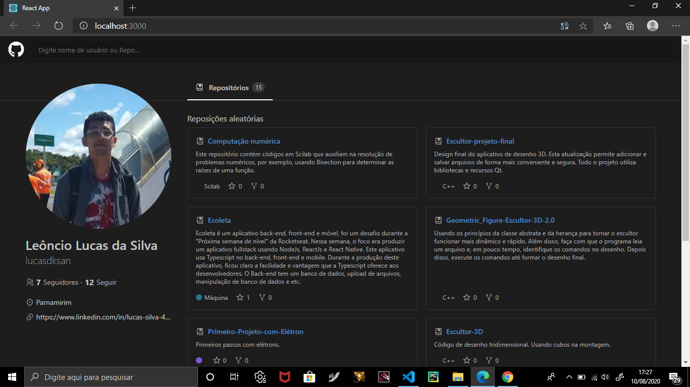

# Clone Frontend of the Github platform.
## This clone built using the wisdom of Rocketseat classes.
### This cloning focuses only on the platform layout and the consumption of the github API, thus making this application more dynamic and more fun.

### The image below demonstrates the interface of this cloning.
### The whole project is done with ReactJs + Typescript.

### The next image shows the project's responsiveness.

### The image below shows the project with its night version

### This is version 1.0
### The next version will have more details. S2

